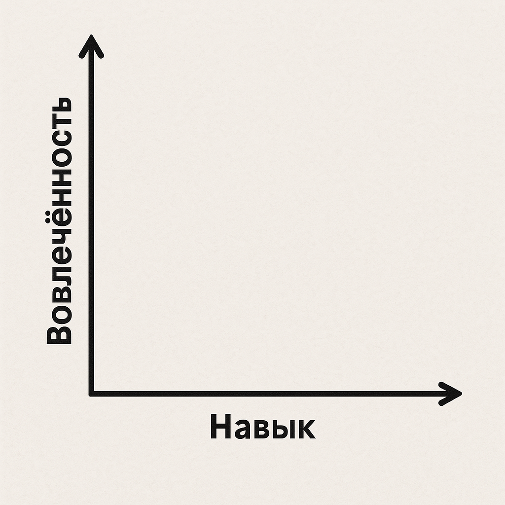

# Способность и вовлеченность

Ученики бывают очень разными: кто-то вовлечён и активен, а кто-то — менее заинтересован. Одни уже имеют определённые навыки, другие — полные новички. И к каждому из этих типов нужен свой подход.

<figure><figcaption></figcaption></figure>

**Давайте по порядку разберём каждый тип ученика и подумаем, как облегчить себе работу с ними.**

#### **1. Вовлечённые, но пока не способные**

Начнём с этой группы, потому что с ними работать проще всего. Эти ребята лучше других понимают, зачем пришли на курс, и редко нарушают дисциплину. Основная угроза — потеря мотивации из-за неудач. В этом случае они рискуют перейти в категорию "не вовлечённых и неспособных".

Чтобы этого не произошло, нужна профилактика:\
— Отмечайте их успехи.\
— Подчеркивайте прогресс.\
— Подбадривайте.

Если какое-то задание кажется им слишком сложным — предложите альтернативу попроще, но подайте это не как "упрощёнку", а как "альтернативный формат". Это поможет сохранить интерес и не уронить самооценку.

***

#### **2. Способные, но не вовлечённые**

Обычно это ученики, которые считают, что уже всё знают, и поэтому теряют интерес. Они могут отвлекать других, особенно если скучают.

Как с ними работать?

**Способ 1 — Простое задание.**\
Дайте им нечто несложное, чтобы втянуть их в работу. Иногда достаточно просто начать, и интерес просыпается сам.

**Способ 2 — Сложное задание.**\
Если ученик легко и с высокомерием справился с простым заданием, дайте ему что-то действительно сложное. Покажите, что совершенствоваться ещё есть куда. Сделайте акцент: если он включится в процесс, найдёт много нового. Если же нет — другие быстро его перегонят.

***

#### **3. Вовлечённые и способные**

Это главные фанаты вашего курса — и вас лично. Чаще всего они проявляют повышенное внимание и требуют много вашего времени. Это может отвлекать вас от других учеников.

Используйте эту активность с пользой:\
— Поручайте таким ученикам помогать другим.\
— Давайте возможность отвечать на вопросы, делегируйте часть задач.

Это поможет снизить нагрузку на вас и удержать их мотивацию. Но есть риск: они могут почувствовать себя "равными преподавателю", потерять чувство субординации.

Чтобы этого не произошло, держите под рукой:\
— Пару действительно сложных задач.\
— И, если нужно, пару строгих, но справедливых замечаний.

Присмотритесь получше к этим людям - вполне возможно, что это будущие преподватели Сигмы!

***

#### **4. Не вовлечённые и не способные**

На любом курсе может оказаться ученик, который сам не понимает, зачем пришёл. Это могут быть случайные слушатели или те, кто просто «пришёл за компанию».

Это самая сложная категория. Если у вас небольшая группа и достаточно ресурсов — можно попробовать подтянуть такого ученика в первые занятия. Например, выделить для него отдельный трек, не зависящий от основной программы.

Если вы преподаёте, скажем, продвинутое программирование, а ученик с трудом включает компьютер — направьте его, например, на базовый курс на Stepik. Помогайте в свободное время, но не за счёт остальной группы.

Важно помнить: нет "плохих" учеников. Но и одному не стоит давать испортить обучение для всех. В крайнем случае, обсудите ситуацию с коллегами — возможно, кто-то сможет взять его под своё крыло.
